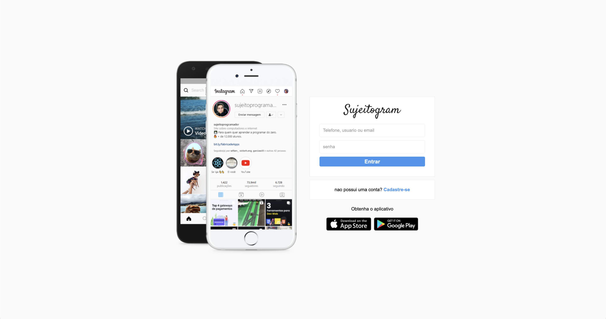
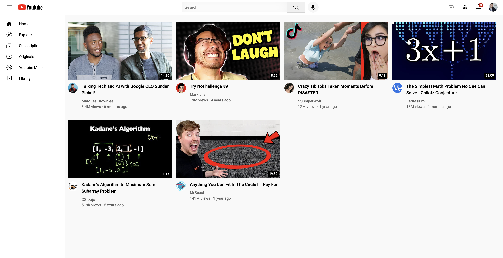
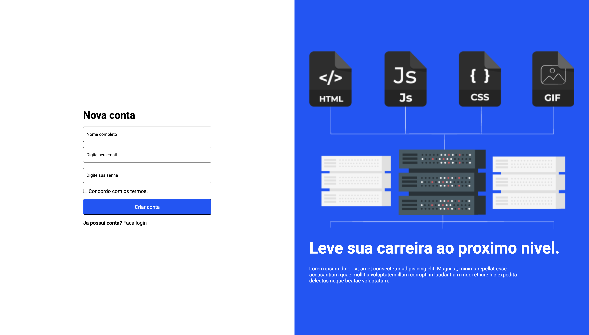

<h1 align="center">FullStackRoad 🛤️</h1>

  Repositório dedicado à organização da minha jornada de aprendizagem, exercícios práticos e projetos de desenvolvimento web (Front-end e Back-end). Este repositório reflete o meu progresso no curso <strong>FullStack Pro</strong> da <a href="https://hotmart.com/pt-br/club/sujeito-programador/products/1793920">Sujeito Programador</a>.

---

## 🎯 Sobre o Repositório

O meu objetivo atual é consolidar as bases e avançar até ao domínio do ecossistema React/Next.js e Node.js, após ter cimentado conhecimentos em HTML, CSS e JavaScript.

Este repositório serve também como demonstração da minha evolução prática e dedicação para me tornar um **Junior FullStack Developer**.

---

## 🚀 Tecnologias Abordadas no Curso

O curso FullStack Pro é um programa completo (do zero ao avançado) que foca as tecnologias mais procuradas pelo mercado. Ao longo deste percurso, estarei a trabalhar com:

  
  
  
  
  
  
  
  

---

## 💻 Projetos

Durante a aprendizagem, os seguintes projetos front-end foram desenvolvidos para treinar conceitos de marcação semântica, estilos responsivos (CSS Flexbox/Grid) e lógica com JavaScript.

### [1. Portefólio Pessoal](./Projetos/Portfolio)
Página de portefólio responsiva para apresentar o meu perfil, conhecimentos e ligações para outros projetos.
 

### [2. Interface do Instagram (Login)](./Projetos/Instagram)
Recriação da página inicial e de login do Instagram, desenvolvida para praticar a estruturação de formulários, organização de *assets* e layout responsivo.
 

### [3. Layout do YouTube](./Projetos/Youtube)
Página estática com a interface clássica do YouTube. O foco principal foi o uso de `CSS Grid`, barras laterais (*sidebars*), miniaturas (*thumbnails*) e espaçamentos globais.
 

### [4. Página de Login Moderna](./Projetos/Login%20Page)
Uma página de login moderna para treinar conceitos de UI/UX e alinhamentos CSS.
 

### [5. Lista de Tarefas (To-Do List)](./Projetos/Lista%20de%20tarefas)
Aplicação para gerir tarefas, criada para começar a interagir com lógica JavaScript aplicada ao DOM.

### [6. Feed Social](./Projetos/Feed)
Interface simples que simula um feed de uma rede social.

---

## 📚 Material de Estudo e Desafios

Além dos projetos finais, mantenho o código dos desafios de cada módulo para futura consulta e revisão de conceitos.

- **[Módulo HTML](./HTML)**: Estruturação, tags semânticas, tabelas, formulários, áudio e vídeo.
- **[Módulo CSS](./CSS)**: Seletores, modelo de caixas (*box model*), flexbox, grid, animações e responsividade.
- **[Módulo JavaScript](./JavaScript)**: Lógica de programação, variáveis, funções, manipulação de arrays e objetos, manipulação do DOM e eventos.
- **[Desafios JS](./Desafios)**: Exercícios de treino de JavaScript (`01-js`, `02-js`, `03-js`).

---

## 📞 Contacto

<a href="https://www.linkedin.com/in/belarmino-sacate-1b830037b/">
  
  LinkedIn Profile
</a>
 
 
<a href="mailto:belarmino.s.bs@gmail.com">
  
  belarmino.s.bs@gmail.com
</a>
